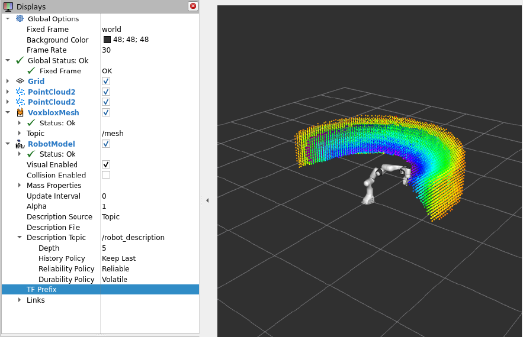

# Uncertainty-Aware MPC: Probabilistic SDFs & Active Visibility

  

This repository contains the implementation for the Master's Thesis:\
***"Uncertainty-Aware MPC: Probabilistic SDFs and Active Visibility for
Dynamic Clutter"***.

The framework integrates a probabilistic environment model (**Voxblox
ROS 2 migration**) with a **Model Predictive Control (MPC)** planner.\
It enables a **Franka Emika Panda** robot to navigate **dynamic,
cluttered environments** while maintaining a probabilistic world model
and actively maximizing target visibility ("peeking").



## 📌 Project Overview

This system addresses motion-planning in **uncertain, dynamic
environments**, where both collision avoidance and visual observability
must be optimized.

### Key Features

-   **Probabilistic Environment Mapping**
    -   ROS 2-migrated **Voxblox** for TSDF, ESDF, and Occupancy.
    -   Supports real-time incremental updates.
-   **Uncertainty Handling**
    -   Bayesian update for voxel probabilities.
    -   Memory decay for dynamic obstacles (e.g., other robots).
-   **Active MPC Planning**
    -   MPC cost reformulated using **ESDF gradients**.
    -   Real-time differentiable **ray-casting** for maximizing
        visibility to targets.

## 🏗️ System Architecture

1.  **`tsdf_server_node`**\
    Consumes depth/pointcloud data to build a Truncated Signed Distance
    Field (TSDF).

2.  **`esdf_server_node`**\
    Computes the Euclidean Signed Distance Field (ESDF), used by the MPC
    to compute collision gradients.

3.  **MPC Planner (External Node)**\
    Subscribes to ESDF, computes optimal control.

## ⚙️ Installation

### Prerequisites

-   Ubuntu 22.04
-   ROS 2 Humble
-   colcon, rosdep

## 🔧 Build Instructions

``` bash
mkdir -p ~/ws_thesis/src
cd ~/ws_thesis/src
git clone <YOUR_REPO_URL>

cd ~/ws_thesis
rosdep install --from-paths src --ignore-src -r -y
colcon build --symlink-install --cmake-args -DCMAKE_BUILD_TYPE=Release
source install/setup.bash
```


## 🔧 Key Launch Parameters (Corrected & Detailed)

Below are the main runtime parameters used by the TSDF/ESDF nodes and recommended values for MPC usage.
Each parameter name corresponds to the ROS parameter (or YAML key) used in the launch/config files.

| Parameter (ROS name) | Type | Example / Default | Units | Description & Recommended Range |
|---|---:|---:|---:|---|
| `generate_esdf` | `bool` | `true` | — | Enable ESDF generation from the TSDF. **Required for MPC**. |
| `update_esdf_every_n_sec` | `float` | `0.5` | seconds | How often the ESDF is recomputed. **Lower = more reactive**. Recommended range: `0.1` — `1.0` (use `0.2`–`0.5` for reactive robot control). |
| `update_mesh_every_n_sec` | `float` | `0.0` | seconds | How often a visualization mesh is generated. Set to `0.0` to disable (saves CPU). Use `>0.5` for slow updates only. |
| `publish_pointclouds` | `bool` | `false` | — | Publish TSDF/ESDF as pointcloud topics. Disable to reduce ROS bandwidth. |
| `publish_slices` | `bool` | `true` | — | Publish 2D cross-section slices for debugging/visualization in RViz. |
| `tsdf_voxel_size` | `float` | `0.05` | meters | Voxel side length used in the TSDF. **Important:** earlier text mistakenly listed `0.055cm` — that was a typo. Use **meters**. Typical tabletop manipulation: `0.02`–`0.05` m (2–5 cm). |
| `tsdf_truncation_distance` | `float` | `0.10` | meters | Truncation distance for TSDF integration (usually 2–3 × voxel size). Recommended: `2 * tsdf_voxel_size` — `4 * tsdf_voxel_size`. |
| `esdf_max_distance` | `float` | `2.0` | meters | Maximum distance value published in ESDF topics/slices. |
| `memory_decay_half_life` | `float` | `5.0` | seconds | (If implemented) Half-life for probabilistic memory decay of voxels (controls how fast dynamic obstacles are forgotten). Tune based on environment dynamics. |

### Example YAML snippet (config/voxblox_params.yaml)
```yaml
tsdf_server:
  tsdf_voxel_size: 0.05
  tsdf_truncation_distance: 0.10
  publish_pointclouds: false
  publish_slices: true

esdf_server:
  generate_esdf: true
  update_esdf_every_n_sec: 0.5
  update_mesh_every_n_sec: 0.0
  esdf_max_distance: 2.0
  memory_decay_half_life: 5.0
```

### How to override on `ros2 launch` (example)
You can override parameters at launch or via a parameters YAML file:

```bash
ros2 launch voxblox_ros cow_and_lady_dataset.launch.py   params_file:=/path/to/voxblox_params.yaml
```

Or override a single parameter from the command line (depending on your launch file):
```bash
ros2 launch voxblox_ros cow_and_lady_dataset.launch.py   tsdf_server.tsdf_voxel_size:=0.03 esdf_server.update_esdf_every_n_sec:=0.2
```

---


# 🚀 Usage

## Running Dataset Experiments

``` bash
ros2 launch voxblox_ros cow_and_lady_dataset.launch.py bag_file:=data_ros2
```

## 🔧 Key Parameters

| Parameter | Value | Reason |
|----------|-------|--------|
| `generate_esdf` | True | Required for MPC distance fields |
| `update_esdf_every_n_sec` | 0.5–1.0 | High-frequency ESDF updates for reactive planning |
| `update_mesh_every_n_sec` | 0.0 | Disabled to save CPU |
| `publish_pointclouds` | False | Reduce traffic on ROS topics |
| `publish_slices` | True | Debugging / visualization |
| `tsdf_voxel_size` | 0.05 m | Good resolution for manipulation tasks |


## 📊 Visualization

Use RViz displays:

- **ESDF PointCloud**  
  Topic: `/voxblox_node/esdf_pointcloud`

- **ESDF Slice**  
  Topic: `/voxblox_node/esdf_slice`

## 🛠️ Migration Status

| Component | Status |
|----------|--------|
| TSDF Server | ✅ |
| ESDF Server | ✅ |
| Mesh Integrator | 🛠️ (Disabled by default) |
| Evaluator Nodes | ❌ Not migrated |

# 👨‍🎓 Thesis Information

Author: Joel Agustin Sanchez\
Supervisors: Prof. Dr.-Ing. Steven Liu, M.Sc. Chen Cai\
Institution: RPTU Kaiserslautern-Landau, Germany

# 📄 Citation

``` bibtex
@inproceedings{oleynikova2017voxblox,
  author={Oleynikova, Helen and Taylor, Zachary and Fehr, Marius and Siegwart, Roland and Nieto, Juan},
  booktitle={IEEE/RSJ International Conference on Intelligent Robots and Systems (IROS)},
  title={Voxblox: Incremental 3D Euclidean Signed Distance Fields for On-Board MAV Planning},
  year={2017}
}
```
